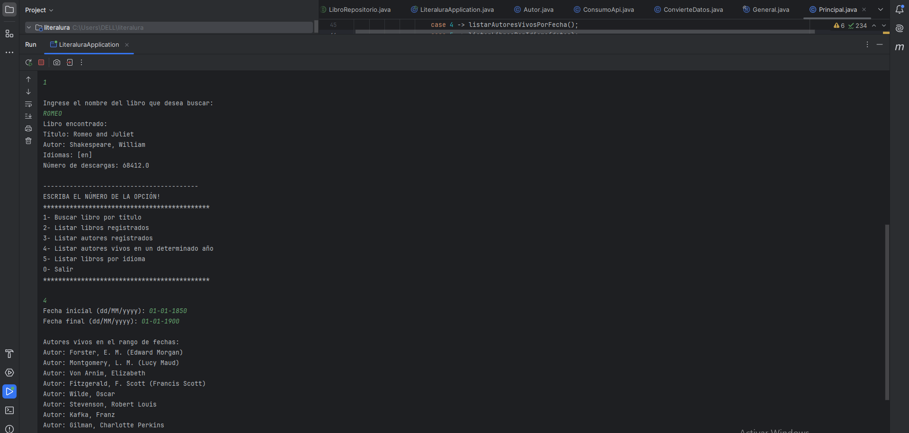

# Proyecto de Literalura



Bienvenido/a al repositorio oficial del proyecto de **LITERALURA**. Aquí encontrarás toda la información necesaria para clonar, instalar y usar este proyecto.

## Descripción

Este proyecto tiene como objetivo realizar búsquedas de libros contenidos en la API Gutendex. Las búsquedas se pueden realizar por nombres de libro, de autor, de idiomas o por fecha.

## Instalación

Sigue estos pasos para clonar y configurar el proyecto en tu máquina local:

1. Clona el repositorio:
   ```bash
   git clone https://github.com/Carmensl2024/literalura.git
   ```

2. Accede al directorio del proyecto:
   ```bash
   cd literalura
   ```

3. Instala las dependencias:
   ```bash
   npm install
   ```

## Uso

Para iniciar el proyecto, ejecuta el siguiente comando:

```bash
npm start
```

Luego, abre tu navegador en `http://localhost:8080` para visualizar la aplicación.

## Contribución

Si deseas contribuir a este proyecto, por favor sigue estos pasos:

1. Haz un fork del repositorio.
2. Crea una rama con un nombre descriptivo:
   ```bash
   git checkout -b nombre-de-tu-rama
   ```
3. Realiza tus cambios y haz un commit:
   ```bash
   git commit -m "Descripción de los cambios"
   ```
4. Envía tus cambios al repositorio remoto:
   ```bash
   git push origin nombre-de-tu-rama
   ```
5. Abre un Pull Request para revisión.

## Créditos

Este proyecto es desarrollado por  **Carmen Sánchez** y apoyado por **Alura Latam y Oracle**. 


